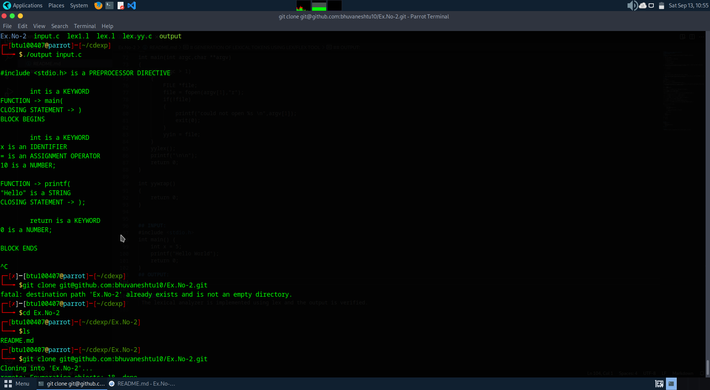

# Ex.No :2
# GENERATION OF LEXICAL TOKENS USING LEX/FLEX TOOL
## Register Number:212224040049
## Date:09/09/2025
## AIM
 To write a lex program to implement lexical analyzer to recognize a few patterns.
## ALGORITHM

1.	Start the program.

2.	Lex program consists of three parts.

     a.	Declaration %%

     b.	Translation rules %%

     c.	Auxilary procedure.

3.	The declaration section includes declaration of variables, maintest, constants and regular definitions.
4.	Translation rule of lex program are statements of the form

    a.	P1 {action}

    b.	P2 {action}

    c.	…

    d.	…

    e.	Pn {action}

5.	Write a program in the vi editor and save it with .l extension.

6.	Compile the lex program with lex compiler to produce output file as lex.yy.c. eg $ lex filename.l $ cc lex.yy.c
7.	Compile that file with C compiler and verify the output.

## PROGRAM:
    %{
 int COMMENT=0;
%}
identifier [a-zA-Z][a-zA-Z0-9]*
%%
#.* { printf("\n%s is a PREPROCESSOR DIRECTIVE",yytext);} 

int|float|char|double|while|for|do|if|break|continue|void|switch|case|long|struct|const|typedef|return|else|goto { 
    if(!COMMENT) printf("\n\t%s is a KEYWORD",yytext);
}

"/*" { COMMENT = 1; }
"*/" { COMMENT = 0; }

{identifier}\( { if(!COMMENT) printf("\nFUNCTION -> %s",yytext); }

\{ { if(!COMMENT) printf("\nBLOCK BEGINS"); }
\} { if(!COMMENT) printf("\nBLOCK ENDS"); }

{identifier}(\[[0-9]*\])? { if(!COMMENT) printf("\n%s is an IDENTIFIER",yytext); }

\".*\" { if(!COMMENT) printf("\n%s is a STRING",yytext); }

[0-9]+ { if(!COMMENT) printf("\n%s is a NUMBER",yytext); }

\)(\;)? { if(!COMMENT) printf("\nCLOSING STATEMENT -> %s",yytext); }

\( { if(!COMMENT) printf("\nOPENING PARENTHESIS"); }

= { if(!COMMENT) printf("\n%s is an ASSIGNMENT OPERATOR",yytext); }

\<=|\>=|\<|==|\> { if(!COMMENT) printf("\n%s is a RELATIONAL OPERATOR",yytext); }

%%
int main(int argc,char **argv)
{
    if (argc > 1)
    {
        FILE *file;
        file = fopen(argv[1],"r"); 
        if(!file)
        {
            printf("could not open %s \n",argv[1]); 
            exit(0);
        }
        yyin = file;
    }
    yylex(); 
    printf("\n\n"); 
    return 0;
} 

int yywrap()
{
    return 0;
}

## INPUT:
#include <stdio.h>
int main() {
    int x = 5;
    printf("Hello World");
    return 0;
}
## OUTPUT:

## RESULT:
 The lexical analyzer is implemented using lex and the output is verified.
